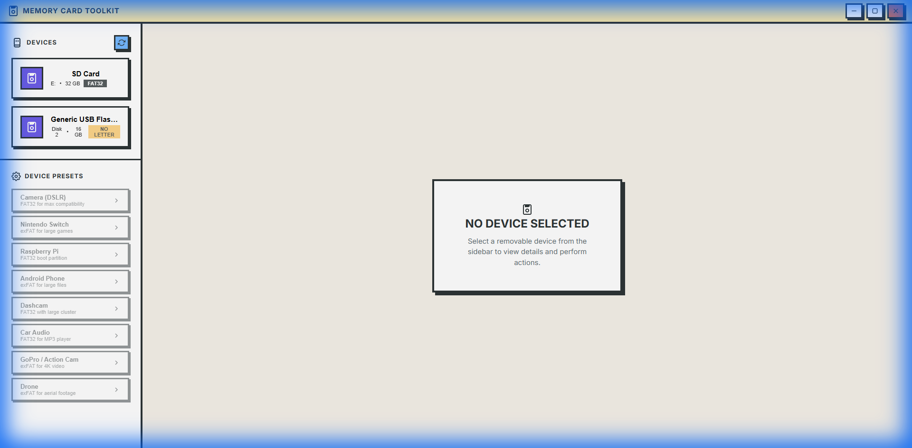
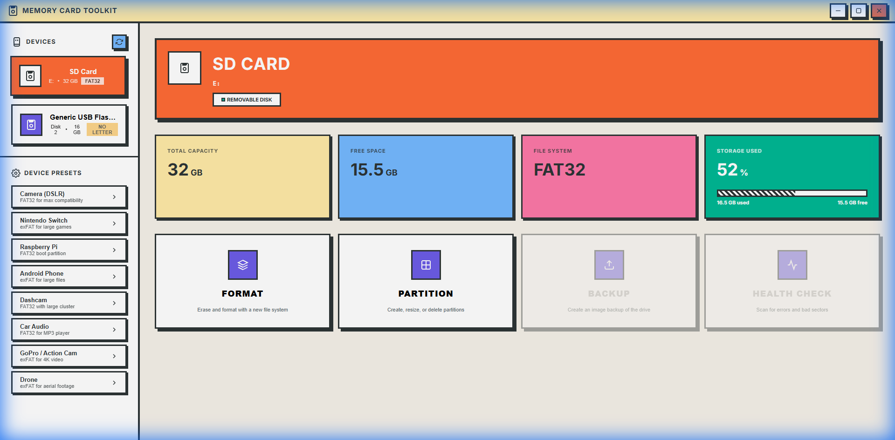

# Memory Card Toolkit

<div align="center">



**A powerful desktop application for configuring, formatting, and managing memory cards with a bold Neo Brutalism UI.**

[](LICENSE)
[](https://www.electronjs.org/)
[](https://reactjs.org/)
[](https://github.com/minhvu2212/memory-card-toolkit/releases)

[Download](#installation) • [Features](#features) • [Screenshots](#screenshots) • [Contributing](#contributing)

</div>

---

## ✨ Features

### 🔧 Disk Management
- **Full Disk Detection** - Detect all USB drives including those without drive letters
- **Assign Drive Letters** - Assign letters to unrecognized disks
- **Initialize Disks** - Initialize RAW disks as MBR or GPT
- **Format Drives** - Quick and full format with FAT32, exFAT, or NTFS

### 📱 Device Presets
Pre-configured settings for popular devices:
- **Cameras** (Canon, Nikon, Sony) - FAT32 optimized
- **Nintendo Switch** - exFAT for large games
- **Raspberry Pi** - FAT32 boot partition
- **Android Phones** - exFAT for large files
- **Dashcams** - Loop recording optimized
- **GoPro/Action Cams** - 4K video ready
- **Drones** - High-speed write optimized

### 🎨 Modern UI
- **Neo Brutalism Design** - Bold colors, thick borders, hard shadows
- **Real-time Device Info** - Capacity, free space, file system at a glance
- **Safe Formatting** - Multi-step confirmation to prevent accidents
- **System Drive Protection** - C: drive is always protected

---

## 📸 Screenshots

<div align="center">

### Initial State

*Clean interface with device presets ready for quick configuration*

### Device Details

*Detailed view with storage visualization and quick actions*

</div>

---

## 🚀 Installation

### Download
Download the latest installer from [Releases](https://github.com/minhvu2212/memory-card-toolkit/releases).

### Build from Source

```bash
# Clone the repository
git clone https://github.com/minhvu2212/memory-card-toolkit.git
cd memory-card-toolkit

# Install dependencies
npm install

# Run in development mode
npm run dev

# Build for Windows
npm run build:win
```

---

## 📁 Project Structure

```
memory-card-toolkit/
├── src/
│   ├── main/           # Electron main process
│   │   ├── main.js     # Window management & IPC
│   │   ├── preload.js  # Context bridge
│   │   └── diskService.js  # Disk operations
│   └── renderer/       # React frontend
│       ├── components/ # UI components
│       ├── data/       # Presets & configs
│       └── styles/     # Neo Brutalism CSS
├── public/             # Static assets
├── docs/               # Documentation
└── dist-electron/      # Build output
```

---

## 🛠️ Technology Stack

| Category | Technology |
|----------|------------|
| Framework | Electron 28 |
| Frontend | React 18 |
| Build Tool | Vite |
| Styling | Custom CSS (Neo Brutalism) |
| Disk Operations | PowerShell / Diskpart |

---

## ⚠️ Important Notes

- **Administrator Required** - The app requires admin privileges for disk operations
- **Windows Only** - Currently supports Windows 10/11
- **Backup First** - Always backup important data before formatting
- **System Protection** - The C: drive cannot be formatted

---

## 🤝 Contributing

Contributions are welcome! Please read our [Contributing Guide](CONTRIBUTING.md) and [Code of Conduct](CODE_OF_CONDUCT.md).

1. Fork the repository
2. Create your feature branch (`git checkout -b feature/amazing-feature`)
3. Commit your changes (`git commit -m 'Add amazing feature'`)
4. Push to the branch (`git push origin feature/amazing-feature`)
5. Open a Pull Request

---

## 📄 License

This project is licensed under the MIT License - see the [LICENSE](LICENSE) file for details.

---

## 💖 Support

If you find this project helpful, consider supporting its development:

- ⭐ Star this repository
- 🐛 Report bugs and request features
- 💰 Donate via crypto: `0x4b5755585572a271CFf3041CA8F7290de281D5bB`

---

<div align="center">

**Made with ❤️ by [minhvu2212](https://github.com/minhvu2212)**

</div>
